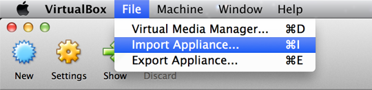
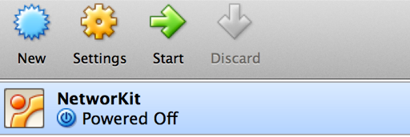

===============================
NetworKit VM Installation Guide
===============================

This step-by-step guide will help you through the installation of NetworKit in a virtual machine.

.. note:: This type of installation is only recommended for users running Microsoft Windows or for testing NetworKit since the
  performance might be worse due to virtualization.

Step 1 - Installing Oracle VM VirtualBox
----------------------------------------

If you do not already have VirtualBox installed on your system, visit https://www.virtualbox.org/wiki/Downloads and download the right VirtualBox
binary for your system. Once downloaded, run the setup and follow the instructions to install VirtualBox on your system.

Step 2 - Import NetworKit VM into VirtualBox
--------------------------------------------

First, download the `NetworKit VM <https://networkit.iti.kit.edu/uploads/networkit-vm.zip>`_. After that, open VirtualBox and click on „File -> Import Appliance ...“
or the corresponding entry in your system language.

|

In the opening dialog, click on the small folder icon and specify the path to the NetworKit VM file you downloaded.
Hitting „Next“ will show you some options for setting up the virtual machine (number of cores, amount of RAM, etc.).
The standard settings should be fine for the moment and you can finish this step by clicking the „Import“ button.

Step 3 - Running the NetworKit VM
---------------------------------

After the previous steps, you will find an entry „networkit“ in the left list of available virtual machines in VirtualBox.
To start the virtual machine, double click on „networkit“ or select the entry and click on the „Start“ button in the top
menu bar.

|

The current version of NetworKit is preinstalled and can be found in the folder linked on the desktop. Now you can continue
to read our `Get Started <get_started.html>`_ guide to see how to build the C++ part of NetworKit if you want to develop new
algorithms or to see how you can use NetworKit with IPython. Make sure to check out the
`NetworKit UserGuide <http://nbviewer.ipython.org/urls/networkit.iti.kit.edu/uploads/docs/NetworKit_UserGuide.ipynb>`_ to see usage
examples.

Shared folders
--------------

In order to access files of your host system in the NetworKit VM and vice versa, you can point VirtualBox to a shared folder on your host system.
To add a shared folder, open the settings of the NetworKit VM by selecting "networkit" from the list of available virtual machines and click "Settings".
Change to the "Shared Folders" section and press the small folder symbol to the right. A dialog will popup that asks for the path to the folder you
want to share with the NetworKit VM. The folder name can be left as is or changed to some other name that will be displayed in the virtual machine. Make
sure to click "Auto-mount" such that the folder is automatically mounted when you start the virtual machine. The folder should now be accessible from the
file manager in the NetworKit VM. For further information on shared folders, please visit the `VirtualBox manual <https://www.virtualbox.org/manual/ch04.html#sharedfolders>`_.
