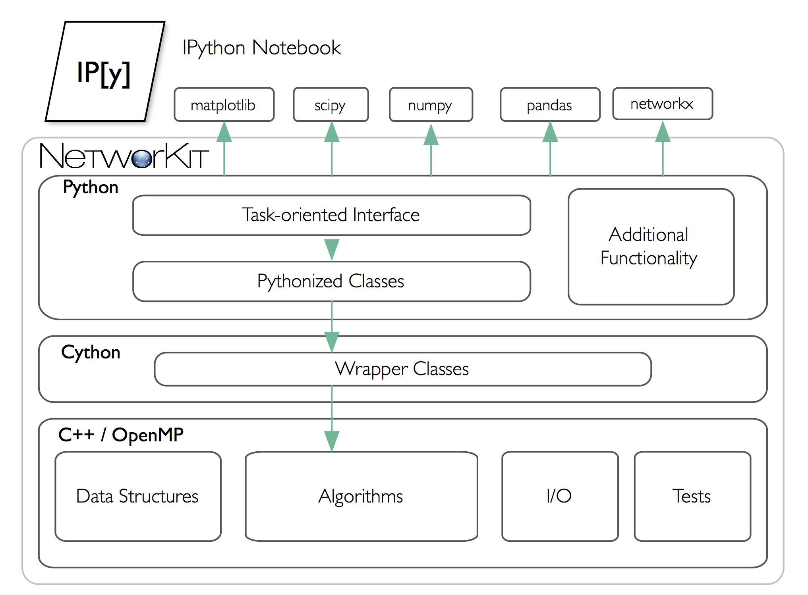
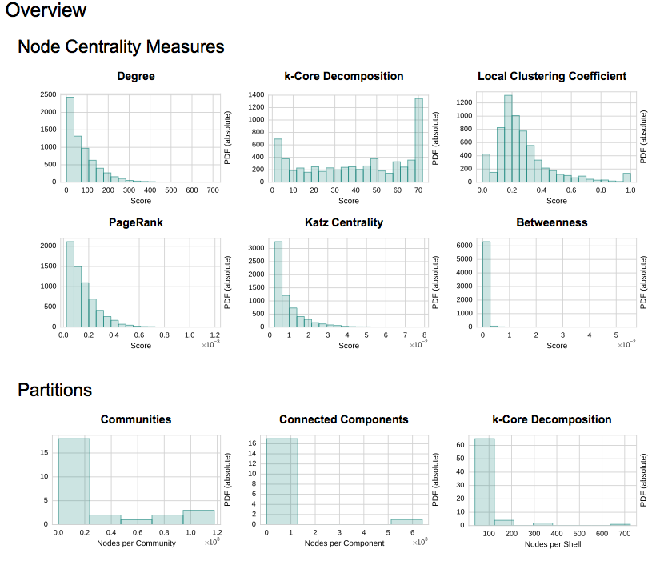

.. |br| raw:: html

    

.. |separator| raw:: html

	

========
Features
========

**NetworKit** is implemented as a hybrid of high-performance code written in C++, with an interface and additional functionality written in Python. NetworKit is distributed as a Python package, ready to use interactively from a Python shell, which is the main usage scenario we envision. However, the code can also be used as a library for application programming, either at the Python or the C++ level. Throughout the project we use object-oriented and functional concepts. On the C++ level, we make extensive use of closures, using the lambda syntax introduced with C++11. Shared-memory parallelism is realized with OpenMP, providing loop parallelization and synchronization constructs while abstracting away the details of thread creation and handling. 

Connecting these native implementations to the Python world is enabled by the Cython toolchain. Among other things, Cython can compile pure Python code to C or C++, circumventing the Python interpreter, and also allows for static type annotations – yielding considerable speedup in combination. Currently we use Cython merely to integrate native code by compiling it into a native Python extension module. As a benefit of Python integration, NetworKit's functionality can be accessed interactively. Thus, analysis kernels can be freely combined. Furthermore, NetworKit can be seamlessly integrated into the rich Python ecosystem for data analysis. We consider this kind of integration crucial for real-world data analysis workflows

|separator|

In the following, we present the key features NetworKit provides. Example workflows, highlighting the interactive capabilities of NetworKit, can be found in the `UserGuide <http://nbviewer.ipython.org/urls/networkit.iti.kit.edu/data/uploads/docs/NetworKit_UserGuide.ipynb>`_.

`Network Profiling`_

`Fundamental Network Analytics`_

* `Degree Distribution`_
* `Degree Assortativity`_
* `Diameter`_
* `Clustering Coefficients`_
* `Components and Cores`_
* `Centrality`_

`Community Detection`_

`Graph Generators`_

`Visualization`_

`Integration with other Tools`_

|separator|

Network Profiling 
-----------------

To see the most important features of a network at a glance, NetworKit provides the *Profiling* module. The module assembles many algorithms into one program, automates analysis tasks and produces a graphical report to be displayed in the Jupyter Notebook or exported to an HTML or LATEX report document. For example, the following is a an excerpt of the Profiling report for the graph *MIT8.edgelist* (available in the NetworKit repository):

For detailed instructions on how to use the Profiling module take a look at our `Profiling Notebook <http://nbviewer.jupyter.org/urls/networkit.iti.kit.edu/data/uploads/docs/Profiling.ipynb>`_.

|separator|

Fundamental Network Analytics
-----------------------------

In the current release of NetworKit, we provide an implementation of the following network analysis methods. In addition, NetworKit also includes a collection of basic graph algorithms, such as breadth-first and depth-first search, Dijkstra's algorithm for shortest paths and code for computing approximate maximum weight matchings.

Degree Distribution
^^^^^^^^^^^^^^^^^^^

The degree distribution plays an important role in characterizing a network: Empirically observed complex networks tend to show a heavy tailed degree distribution which follow a power-law with a characteristic exponent. In NetworKit, we provide a function which returns whether a power law degree distribution is considered as a good fit, and a parameter quantifying the goodness of the fit. In case a power law degree distribution is present, a function returns the exponent, which has been found to be a characteristic property.

Degree Assortativity
^^^^^^^^^^^^^^^^^^^^

Generally, a network shows assortative mixing with respect to a certain property P if nodes with similar values for P tend to be connected to each other. Degree assortativity measures the mixing with respect to node degree, which can point to important aspects such as a hierarchical network composition. Its strength is often expressed as degree assortativity coefficient r, which lies in the range between -1 and 1. High values occur in networks with assortative mixing by degree such as many social networks. In NetworKit, we implemented Newman's formulation in linear time and constant memory requirements.

Diameter
^^^^^^^^

The diameter of a graph is the maximum length of a shortest path between any two nodes. A surprising observation about the diameter of complex networks is often referred to as the *small world phenomenon*: The diameter tends to be very small and is often constant or even shrinks with network growth. While NetworKit provides a function to calculate the exact diameter using BFS for unweighted and Dijkstra's algorithm for weighted graphs, this is impractical for large networks. We therefore also implement an iterative algorithm, which yields upper and lower bounds for the diameter within a specified error margin.

Clustering Coefficients
^^^^^^^^^^^^^^^^^^^^^^^

Clustering coefficients are key figures for the amount of transitivity in networks, i. e. the tendency of edges to form between indirect neighbor nodes. The global clustering coefficient is the ratio of the number of triangles in a network versus the number of paths of length 2. This ratio is typically high in social networks, whose generative processes tend to close triangles. In contrast, the clustering coefficient is close to 0 for random graphs. As a straightforward calculation of the clustering coefficient with a node iterator might be prohibitive for large graphs, NetworKit also implements the wedge sampling approximation algorithm. It runs in essentially linear or even constant time, depending on the respective measure.

Components and Cores
^^^^^^^^^^^^^^^^^^^^

Components and cores are related concepts for subdividing a network: All nodes in a connected component are reachable from each other. A typical pattern in real-world complex networks is the emergence of a giant connected component, accompanied by a large number of very small components. We compute connected components in linear time using a parallel label propagation scheme in which each node adopts the maximum label in its neighborhood. Core decomposition allows a more fine-grained subdivision of the node set according to connectedness. k-cores result from successively peeling away nodes of degree k. It also categorizes nodes according to the highest-order core in which they are contained, assigning a core number to each node. The algorithm implemented in NetworKit uses a bucket data structure for managing remaining node degrees and has a running time which is linear in the number of edges.

Centrality
^^^^^^^^^^

Centrality refers to the relative importance of a node or edge within a network. We distribute efficient implementations for betweenness, closeness, degree, Katz, eigenvector centrality and PageRank.

* **Betweenness:** |br| Betweenness centrality expresses the concept that a node is important if it lies on many shortest paths between nodes in the network. A naive algorithm for calculating betweeness centrality for all nodes would require cubic time. We implement Brandes's algorithm, by which betweenness centrality can be computed more efficiently. Optionally, our implementation computes the scores for unweighted graphs in parallel, at the expense of a larger memory footprint. Since this is still practically infeasible for the large data sets we target, NetworKit includes also a parallelized implementation of a recent approximation algorithm with probabilistic guarantee such that the error is at most an additive constant. |br| |br|

* **Closeness:** |br| Closeness centrality measures the importance of a node by the average distance to every other node in the graph. A node is therefore important when the distances to the other nodes are rather small. Since many real-world complex networks have a small diameter, the range of closeness values for the nodes of such a network is rather small. Computing the closeness values for all nodes would require to solve a single-source shortest path problem for all nodes which makes it infeasible to compute for large networks. We therefore also provide an approximation algorithm that has a probabilistic error guarantee. |br| |br|

* **Degree:** |br| Degree centrality simply ranks the nodes by their degree (i.e. nodes with high degree are more important than nodes having low degrees). The degree centrality can be computed in linear time for all nodes and the algorithm can be parallelized easily. |br| |br|

* **Katz:** |br| Katz centrality is based on the idea that a node is important when the number of its neighbors is high and the other nodes are in close distance to its neighbors. Far away nodes play a less important role which is accomodated for by the use of an attenuation factor. |br| |br|

* **Eigenvector Centrality and PageRank:** |br| Eigenvector centrality and its variant PageRank assign relative importance to nodes according to their connections, incorporating the idea that edges to high-scoring nodes contribute more. PageRank is a version of eigenvector centrality which introduces a damping factor, modeling a random web surfer which at some point stops following links and jumps to a random page. In PageRank theory, centrality is understood as the probability of such a web surfer to arrive on a certain page. Both variants are implemented in NetworKit based on parallel power iteration.

|separator| 

Community Detection
-------------------

Community detection is the task of identifying groups of nodes in the network which are significantly more densely connected among each other than to the rest of nodes. It is a data mining problem where various definitions of the structure to be discovered - the community - exist. This fuzzy task can be turned into a well-defined optimization problem by using community quality measures, first and foremost *modularity*. Modularity measures the quality of a partition of the nodes by comparing its coverage, i. e. the fraction of edges contained within a community, with the coverage it would achieve in a randomized null-model graph. Faced with an NP-hard optimization problem, we engineered parallel heuristics which deliver a good tradeoff between modularity and running time. NetworKit started as a testbed for the novel parallel heuristics PLP, PLM and EPP, which remain a prominent feature.

* **PLP:** |br| Community detection by label propagation extracts communities from a labelling of the node set. Initially, each node is assigned a unique label, and then multiple iterations over the node set are performed in which each node adopts the most frequent label in its neighborhood. Densely connected groups of nodes thus agree on a common label. Each iteration takes linear time, and the algorithm has been empirically shown to reach a stable solution in only a few iterations. The purely local update rule makes label propagation well suited for a parallel implementation. |br| |br|

* **PLM:** |br| The Louvain method (PLM) for community detection can be classified as a locally greedy, bottom-up multilevel algorithm and uses modularity as the objective function. In each pass, nodes are repeatedly moved to neighboring communities so that the locally maximal increase in modularity is achieved, until the communities are stable. Then, the graph is coarsened and the procedure continues recursively. Finally, the communities in the coarsest graph determine those in the input graph by direct prolongation. We provide a shared-memory parallelization of PLM in which node moves are evaluated and performed in parallel instead of sequentially. We also extend the method by an optional refinement phase. |br| |br|

* **EPP:** |br| The EPP ensemble scheme works as follows: In a preprocessing step, assign an ensemble of base algorithms. The graph is then coarsened according to the core communities, which represents the consensus of the base algorithms. Coarsening reduces the problem size considerably, and implicitly identifies the contested and the unambiguous parts of the graph. After the preprocessing phase, the coarsened graph is assigned to the final algorithm, whose result is applied to the input graph by prolongation. We instantiate this scheme with PLP as a base algorithm and PLM or PLMR as the final algorithm. |br| |br|

|separator| 

Graph Generators
----------------

Generative models aim to explain how networks form and evolve specific structural features. Such models and their implementations as generators have at least two important uses: On the one hand, software engineers want generators for synthetic datasets which can be arbitrarily scaled and produce graphs which resemble the real application data. On the other hand, network scientists employ models to increase their understanding of network phenomena. So far, NetworKit provides efficient generators for the following models:

* **Erdös-Renyi Model:** |br| In this simple model edges are created among the nodes with a uniform probability for all pairs of vertices. Not intended to generate realistic graphs, it was viewed as a source of mathematical examples. |br| |br|

* **Clustered Random Graphs:** |br| A simple variation of the Erdös-Renyi model is useful for generating graphs which have distinctive dense areas with sparse connections between them (i.e. communities). Nodes are equally distributed over k subsets, while nodes from the same subset are connected with a higher probability than nodes from different subsets. |br| |br|

* **Barabasi-Albert Model:** |br| This model implements a preferential attachment process ("rich become richer") which results in a power-law degree distribution. The model was introduced in order to produce scale-free networks. |br| |br|

* **R-MAT Generator:** |br| The Recursive Matrix (R-MAT) model was proposed to recreate properties including a power-law degree distribution, the small-world property and self-similarity. The R-MAT generator operates on the initially empty adjacency matrix which is recursively subdivided into four quadrants. Edges are "dropped" into the matrix and land in one of the quadrants according to given probabilities. NetworKit includes an efficient sequential implementation of R-MAT. |br| |br|

* **Chung-Lu Model:** |br| The Chung-Lu model is a random graph model which aims to replicate a given degree distribution. The model can be conceived as a weighted version of the Erdös-Renyi model. |br| |br|

* **Havel-Hakimi Generator:** |br| For a given realizable degree sequence, the algorithm of Havel and Hakimi generates a graph with exactly this degress sequence. While this is similar to the Chung-Lu model, the generative process promotes the formation of closed traingles, leading to a higher (and possibly more realistic) clustering coefficient. |br| |br|

* **Hyperbolic Random Graphs:** |br| Using the exponential expansion of space in hyperbolic geometry, Hyperbolic Random Graphs exhibit high clustering, a power-law degree distribution with adjustable exponentn and natural hierarchy. Points are distributed within a disk in the hyperbolic plane, a pair of points is connected if their hyperbolic distance is below a threshold. |br| |br|

* **PubWeb Generator:** |br| This network model is motivated by the P2P computing library *PubWeb*. Fot the generative process nodes are embedded into the 2D Euclidean unit torus (square with wrap-around boundaries). To create edges, a variation of the disc graph model is employed with a uniform communication radius r for all nodes. A node is connected to up to k nearest neighbors within its communication radius. |br| |br|

|separator|

Visualization
-------------

NetworKit includes basic graph drawing capabilities, implemented on the basis of :code:`matplotlib` and :code:`networkx`. Thus we can produce publication-quality figures within the same session, and without a detour through file I/O. A major overhaul is due in a future release. In the example shown below, a force-directed drawing of the "Les Miserables" character coappearance network is drawn in which the node sizes are proportional to betweeness centrality.

.. image:: resources/lesmis.png
	:align: center

In the next example, we plot the degree distribution of the large web graph *uk-2007-05*, a hyperlink graph of the .uk domain consisting of more than 100 million nodes and 3.3 billion edges.

.. image:: resources/uk2007dd.png
	:align: center

|separator|

Integration with other Tools
----------------------------

As a Python module, NetworKit enables seamless integration with Python libraries for scientific computing and data analysis, e. g. :code:`pandas` for dataframe processing and analytics, :code:`matplotlib` for plotting, :code:`numpy` and :code:`scipy` for numerical and scientific computing and :code:`networkx` for additional network analysis tasks.

Furthermore, NetworKit provides functions to convert graph objects to NetworkX and thereby connects the two modules. One can also use some of the numerous NetworkX functions by importing NetworkX. This opens up a wide range of possibilities which are not yet or will never be implemented within NetworKit. Note however that NetworkX is written mostly in pure Python, its data structures are more memory-intensive and its algorithms do not target very large graphs. You are likely to reach limits of your machine for graphs with millions of edges, while NetworKit aims for good performance for three more orders of magnitude.
